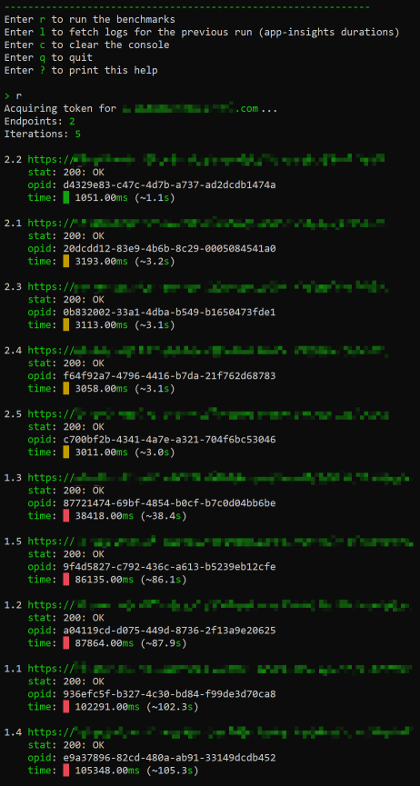

# perfx
Azure API Performance benchmarking tool

---

#### USAGE
`perfx`

  

- Enter **`r`** to **run** the benchmarks
- Enter **`c`** to **clear** the console
- Enter **`q`** to **quit**
- Enter **`?`** to print this **help**

> **PRE-REQ**: Populate the following JSON and save it to your `Documents` folder (`Token` is auto-populated, so leave it blank)
> ```json
> {
>     "UserId": "",
>     "Password": "",
>     "Authority": "https://login.microsoftonline.com/YOUR_COMPANY.onmicrosoft.com",
>     "ClientId": "",
>     "ApiScopes": [
>         "api://YOUR-API-SCOPES"
>     ],
>     "Endpoints": [
>         "https://YOUR-API.COM/route1",
>         "https://YOUR-API.COM/route2"
>     ],
>     "Iterations": 5,
>     "AppInsightsAppId": "",
>     "AppInsightsApiKey": "",
>     "Logging": {
>         "LogLevel": {
>             "Default": "Warning"
>         },
>         "Console": {
>             "IncludeScopes": true,
>             "LogLevel": {
>                 "Default": "Warning"
>             }
>         },
>         "Debug": {
>             "LogLevel": {
>                 "Default": "Information"
>             }
>         }
>     }
> }
> ```

> Also, see [`"allowPublicClient": true`](https://stackoverflow.com/a/57274706)

---

```batch
# Install from nuget.org
dotnet tool install -g perfx --no-cache

# Upgrade to latest version from nuget.org
dotnet tool update -g perfx --no-cache

# Install a specific version from nuget.org
dotnet tool install -g perfx --version 1.0.x

# Uninstall
dotnet tool uninstall -g perfx
```
> **NOTE**: If the Tool is not accessible post installation, add `%USERPROFILE%\.dotnet\tools` to the PATH env-var.

##### CONTRIBUTION
```batch

# Install from local project path
dotnet tool install -g --add-source ./bin perfx

# Publish package to nuget.org
nuget push ./bin/Perfx.1.0.0.nupkg -ApiKey <key> -Source https://api.nuget.org/v3/index.json
```